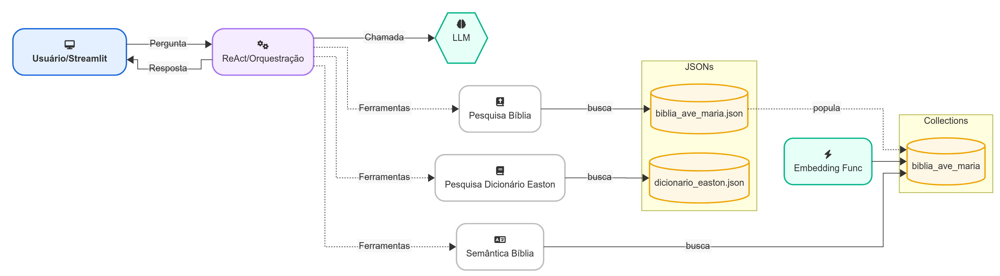

# Projeto RAG Bíblico


**RAG_biblico** é um projeto de **Question Answering Bíblico** que combina **Recuperação e Geração de Respostas (RAG)** usando inteligência artificial.

Ele permite que usuários façam perguntas em linguagem natural sobre a Bíblia, e o sistema responde de forma contextualizada utilizando:

- Busca semântica em versículos bíblicos (ChromaDB)
- Consultas ao Dicionário Bíblico de Easton para contexto histórico e cultural
- Tópicos bíblicos organizados (Naves)
- Acesso direto à Bíblia estruturada em JSON

O projeto integra um ***modelo de linguagem*** para analisar a pergunta, selecionar a melhor fonte de informação e gerar uma resposta precisa, exibida através de uma ***interface web simples em Streamlit***.

**Objetivo:** fornecer uma ferramenta interativa para estudo e pesquisa bíblica, combinando inteligência artificial com dados históricos e textuais da Bíblia.

---
## Estrutura do Projeto

O projeto está organizado de forma simples e modular, facilitando manutenção, leitura e escalabilidade:
```
RAG_Bíblico/
│
├── src/                         # Código principal do projeto
│   ├── biblia_agent.py          # Classe BibliaAgent: lógica de busca e análise de perguntas bíblicas
│   ├── chromadb_utils.py        # Utilitários para o banco de dados vetorial ChromaDB
│   ├── tools.py                 # Funções de busca (Bíblia JSON, Easton, Naves, Semântica)
│   └── system_prompts.py        # Prompts utilizados pelo modelo de linguagem
│
├── imgs/                        # Imagens utilizadas no README.md  
│
├── data/                        # Dados em arquivos JSON
│   ├── bibliaAveMaria.json      # Bíblia em formato JSON
│   ├── dicionario_easton.json   # Dicionário Bíblico Easton em formato JSON
│   └── naves_topical.json       # Nave's Topical Bible em formato JSON
│
├── .env.example                # Exemplo de variáveis de ambiente
├── .gitignore                  # Arquivos e pastas ignoradas pelo Git
├── LICENSE                     # Licença do projeto
├── README.md                   # Documentação do projeto
├── app.py                      # Interface do usuário construída com Streamlit
└── requirements.txt            # Dependências Python do projeto
```
## Arquitetura do agente (Diagrama)



### Como funciona

1. O usuário interage pela interface em `app.py` (Streamlit), enviando uma pergunta em linguagem natural.
2. O agente (`BibliaAgent` em `src/biblia_agent.py`) orquestra o fluxo no estilo ReAct: decide quais ferramentas consultar e em que ordem, e chama o LLM para raciocinar e compor a resposta final.
3. As ferramentas disponíveis (`src/tools.py`) incluem:
   - Pesquisa na Bíblia (JSON `data/bibliaAveMaria.json`).
   - Consulta ao Dicionário de Easton (JSON `data/dicionario_easton.json`).
   - Busca semântica na Bíblia e no Naves por meio do ChromaDB.
4. Um processo de embeddings (Sentence-Transformers) popula as coleções vetoriais do ChromaDB:
   - `biblia_ave_maria` (versículos)
   - `naves_topical` (tópicos/entradas)
5. Durante a pergunta, o agente combina:
   - Recuperação lexical (JSONs) e vetorial (ChromaDB) para coletar passagens e tópicos relevantes.
   - Raciocínio do LLM (`llama-3.3-70b-versatile` via Groq) para sintetizar uma resposta contextualizada e coerente.
6. A resposta é retornada ao Streamlit, podendo incluir trechos e referências dos textos consultados.

> Em caso de primeira execução ou atualização dos dados, o agente verifica/cria as coleções no ChromaDB (ver utilitários em `src/chromadb_utils.py`).

## Requisitos

- Python 3.12.0
- Pip (ou uv/pipx, opcional)
- Conta e chave de API da Groq (para uso do modelo LLM)

## Instalação

1. Clone o repositório e entre na pasta do projeto.
2. Instale as dependências:
   ```bash
   pip install -r requirements.txt
   ```

## Configuração (.env)

Copie `.env.example` para `.env` e defina as variáveis necessárias:

```env
# Chave da API Groq para o modelo de linguagem
GROQ_API_KEY=coloque_sua_chave_aqui
```

## Executando a aplicação

```bash
streamlit run app.py
```

Abra o link exibido no terminal (geralmente `http://localhost:8501`).

## Como usar (Abas da interface)

- Agente Bíblico
  - Escreva uma pergunta em linguagem natural (ex.: "O que a Bíblia ensina sobre perdão?") e clique em "Perguntar". O agente utiliza RAG para compor uma resposta contextualizada.

- Leitura por capítulo
  - Informe o livro (nome ou abreviação) e o capítulo (ex.: "Gênesis", cap. 1) e clique em "Ler capítulo" para exibir todos os versículos.

- Tool de busca no Dicionário Easton
  - Forneça um termo (ex.: "Jesus", "fariseus") para obter a explicação histórica/cultural do Dicionário de Easton.

- Tool de busca semântica no Naves Topical
  - Digite um tema em inglês (ex.: "forgiveness", "faith"). As entradas e passagens relacionadas (em inglês) serão mostradas.

- Tool de busca semântica na Bíblia
  - Busque termos (ex.: "perdão") e veja versículos semanticamente relacionados.

## Tela de carregamento e logs

Ao iniciar, a aplicação exibe uma tela de carregamento com logs em tempo real enquanto o `BibliaAgent` é inicializado e as coleções do ChromaDB são verificadas. 

- Após a inicialização, a tela de carregamento desaparece automaticamente e a interface completa é exibida.

## Tecnologias e dados

- Streamlit (interface web)
- ChromaDB (busca semântica/vetorial)
- Sentence-Transformers (embeddings)
- Groq (LLM) — modelo: `llama-3.3-70b-versatile`
- Fontes de dados em `data/`:
  - `bibliaAveMaria.json`
  - `dicionario_easton.json`
  - `naves_topical.json`

## Licença

Este projeto está licenciado sob os termos da licença incluída em `LICENSE`.

## Créditos

Desenvolvido por **Vitor Eduardo de Lima Kenor**.
